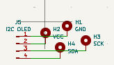
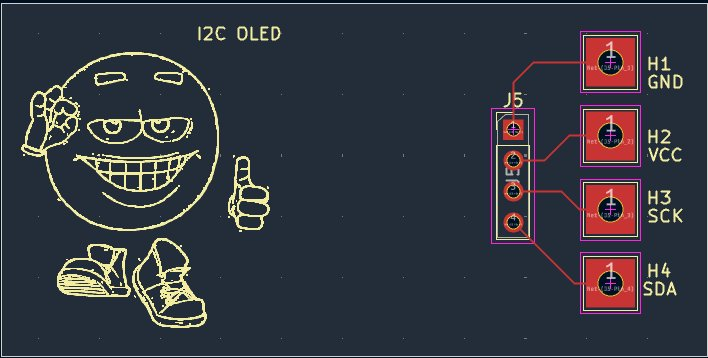
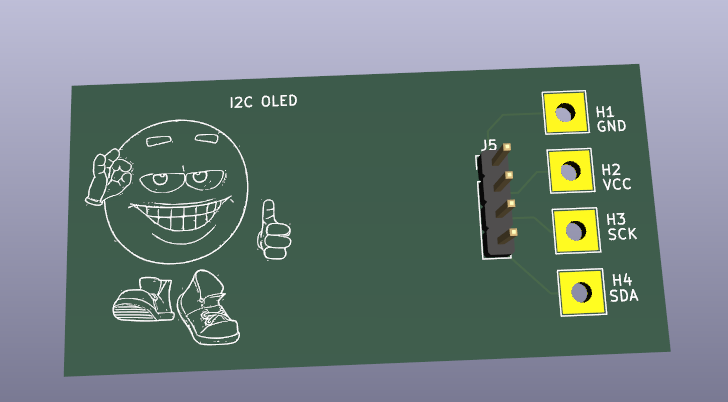
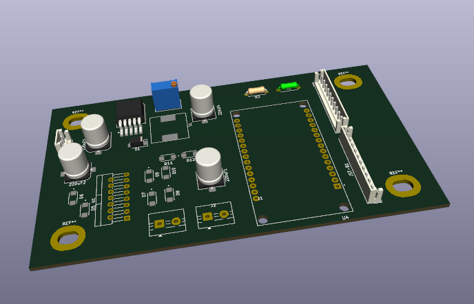
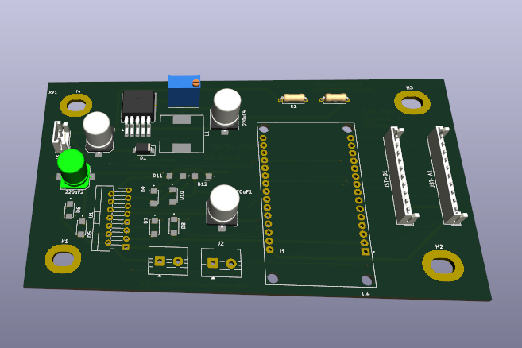
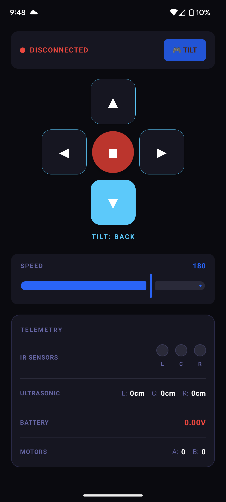
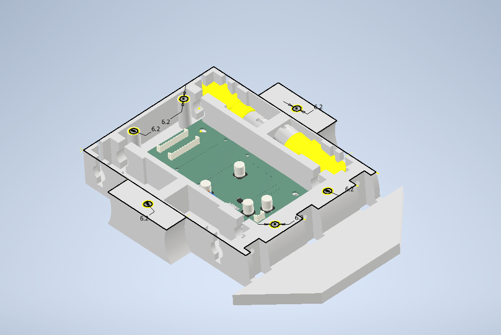

# 🤖 ESP32 Line Sensing Robot

A line-following robot built around the **ESP32-DEV (DEVKITC V1)**, featuring dual motor control via L298N, 3 IR line sensors, 3 ultrasonic distance sensors, and an LM2596S-ADJ buck converter powered by a 2S LiPo (8.8V). Fully controlled via a custom **Android MQTT app** with live telemetry, accelerometer tilt control and WASD buttons.

> **2026-05-11 — Migrated from Arduino to ESP-IDF.**
> All firmware is now pure ESP-IDF (v5.x). Arduino framework, PubSubClient, ArduinoJson, and Adafruit SSD1306 are gone. BLE uses NimBLE, MQTT uses esp-mqtt, I2C uses the legacy driver, ADC uses adc_oneshot. Build with `idf.py build flash monitor`.

---

## 📋 Table of Contents

- [Firmware Build (ESP-IDF)](#firmware-build-esp-idf)
- [Hardware Overview](#hardware-overview)
- [Schematic](#schematic)
- [PCB Layout](#pcb-layout)
- [Pinout Reference](#pinout-reference)
- [JST Connector Wiring](#jst-connector-wiring)
- [Power System](#power-system)
- [Motor Control](#motor-control)
- [Sensors](#sensors)
- [Android App & MQTT Control](#android-app--mqtt-control)
- [PCB Development Process](#pcb-development-process)
- [Known Issues & Planned Fixes](#known-issues--planned-fixes)
- [Build Log](#build-log)

---

## Firmware Build (ESP-IDF)

### Prerequisites

- ESP-IDF v5.x installed — [Installation guide](https://docs.espressif.com/projects/esp-idf/en/stable/esp32/get-started/)
- No additional libraries needed — all dependencies are built-in ESP-IDF components

### Project structure

```
firmware/
├── CMakeLists.txt          ← project root
├── sdkconfig.defaults      ← NimBLE enabled, 8 KB main stack
└── main/
    ├── CMakeLists.txt
    ├── main.c              ← app_main + main loop
    ├── config.h            ← all pin/constant definitions
    ├── provisioning.c/h    ← BLE credential provisioning (NimBLE + NVS)
    ├── sensors.c/h         ← IR, ultrasonic, battery ADC
    ├── state_machine.c/h   ← autonomy logic + motor control (merged)
    ├── mqtt.c/h            ← WiFi STA + MQTT client
    └── oled.c/h            ← SSD1306 driver + 5×7 font
```

### Build & flash

```bash
cd firmware
idf.py set-target esp32
idf.py build
idf.py -p COM<N> flash monitor
```

### First boot — WiFi provisioning

On first boot the ESP32 advertises over BLE as **"IoT-Robot"**. Use any BLE tool (nRF Connect, LightBlue, or your own app) to connect and write JSON to the credential characteristic:

```
Service:    4fafc201-1fb5-459e-8fcc-c5c9c331914b
Char (W+N): beb5483e-36e1-4688-b7f5-ea07361b26a8

Write: {"ssid":"YourWiFi","password":"YourPass","broker":"192.168.x.x"}
Reply: "OK"  (notify, then device restarts)
       "ERR" (notify, bad JSON — try again)
```

Credentials are stored in NVS and survive reboots. To re-provision, call `provisioning_reset()` in firmware.

---

## Hardware Overview

| Component | Part | Notes |
|-----------|------|-------|
| MCU | ESP32-DEV (DEVKITC V1) | Dual-core, WiFi/BT capable |
| Motor Driver | L298N | Repurposed from L298N module — correct Schottky diodes confirmed ✅ |
| Buck Converter | LM2596S-ADJ | 8.8V → 5V, set via RV1 trimpot. Diode: SS34 Schottky ✅ |
| Power Input | Custom 2S 18650 pack (2x 18650 cells) | 8.4V fully charged, connected via JST J3 (2-pin) connector |
| Charger | Hailege 2S USB-C BMS Boost Charger | Step-up boost, charges to 8.4V via USB-C (5V input), overcharge & overcurrent protection |
| Line Sensors | IR Sensor x3 | Digital output, 3.3V — via JST-B (10-pin) |
| Distance Sensors | HC-SR04 x3 | 2021+ version — ECHO outputs 3.3V logic, no voltage divider needed ✅ |
| Control App | Android (Android Studio) | MQTT-based, accelerometer + WASD control |

> ℹ️ **L298N Diodes:** Repurposed from L298N module — correct Schottky freewheeling diodes, no substitution needed.
> ℹ️ **HC-SR04:** 2021+ version confirmed — ECHO outputs 3.3V logic, direct connection to ESP32 GPIO ✅

---

## Schematic

### Full Schematic — Rev 2


*ESP32-DEV DEVKITC V1 + LM2596S-ADJ power section + L298N motor driver + JST-A ultrasonic connector + JST-B IR sensor connector*

### LM2596S-ADJ — Buck Converter & Battery Monitor


*8.8V input via J3 JST (2-pin). R1/R2 voltage divider for battery ADC on D34. LM2596S-ADJ with SS34 Schottky diode D1, inductor L, 220µF output capacitor, RV1 trimpot setting 5V output via FB pin.*

### L298N — Motor Driver


*L298N dual H-bridge with Schottky freewheeling diodes on all outputs. Motor A: IN1 (D13), IN2 (D14), EnA (D21). Motor B: IN3 (D27), IN4 (D26), EnB (D25). Outputs to J1 and J2 screw terminals.*
---

## OLED Display Board

### Overview

A separate small PCB was designed to mount a **128x32 I2C OLED display** (SSD1306) on top of the robot chassis. This board sits above the main PCB, hiding it and making use of the limited space available. It connects directly to the main board via the JST-B connector (IR sensor connector), using the spare pins 6–10.

The board is intentionally minimal — just 4 solder test pad holes (H1–H4) for wire routing, a 4-pin JST connector (J5), and the OLED module. No active components. Gerber files are in the `/gerber` folder.

### Why a Separate Board

- Main PCB had no remaining space for an OLED footprint
- Routing the display on top of the chassis hides the main PCB for a cleaner look
- Easy to detach/replace independently from the main board
- Keeps the display wiring short and organised

### OLED Board Schematic



*J5 (4-pin JST) connects to H1 (GND), H2 (VCC), H3 (SCK), H4 (SDA) test pad holes. Wires run from these pads to the OLED module.*

### OLED Board PCB Layout



*Minimal PCB — 4 test pad holes + JST connector. Designed to sit on top of chassis.*

### OLED Board 3D View



*3D render of the OLED board showing component placement.*

### JST-B Pinout — OLED Connection

The OLED board connects via JST-B (IR sensor connector) spare pins:

| JST-B Pin | Signal | OLED Board | ESP32 GPIO |
|-----------|--------|-----------|-----------|
| 6 | — spare — | — | — |
| 7 | SDA | H4 | D4 — Pin 5 |
| 8 | SCK | H3 | D5 — Pin 8 |
| 9 | VCC (5V) | H2 | — |
| 10 | GND | H1 | — |

> ⚠️ **Voltage check:** Verify your OLED module accepts 5V on VCC. Many SSD1306 modules have an onboard 3.3V regulator and accept 5V input. Bare modules may require 3.3V only.

> ℹ️ **I2C remapping:** ESP32 default I2C pins (D21/D22) are both occupied. I2C is remapped in firmware using `Wire.begin(SDA_PIN, SCL_PIN)`.

### OLED Display Features

**Current:**
- Battery voltage display
- MQTT connection status
- Current mode (MANUAL / LINE FOLLOW)
- Robot state (FOLLOWING / AVOIDING / RECOVERING)

**Planned:**
- IR sensor states (3 indicators)
- Ultrasonic distances (Left / Center / Right cm)

### Build Log — OLED Board

| Date | Entry |
|------|-------|
| 29 Apr 2026 | ECHO Right confirmed on D2 (Pin 4). D4 and D5 reserved for OLED SDA and SCL. |
| 29 Apr 2026 | OLED board designed in KiCad. 128x32 SSD1306 I2C display. Separate PCB to mount on top of chassis. Connects via JST-B spare pins 7–10. Gerbers added to repo. |

---

## PCB Layout



*KiCad PCB layout — to be updated after routing is complete.*

---

## Pinout Reference

### Motor Driver — L298N

| L298N Pin | Label | ESP32 Pin | Type | Notes |
|-----------|-------|-----------|------|-------|
| IN1 | D13 | Pin 28 | Digital Output | Motor A direction |
| IN2 | D14 | Pin 26 | Digital Output | Motor A direction |
| EnA | D21 | Pin 11 | PWM Output | Motor A speed control |
| IN3 | D27 | Pin 25 | Digital Output | Motor B direction |
| IN4 | D26 | Pin 24 | Digital Output | Motor B direction |
| EnB | D25 | Pin 23 | PWM Output | Motor B speed control |

### Battery Monitor

| Function | Label | ESP32 Pin | Notes |
|----------|-------|-----------|-------|
| Battery ADC | D34 | Pin 19 | R1/R2 voltage divider from J3 Pin 2 (8.4V max). Input-only, ADC1 — WiFi safe ✅ |

### IR Line Sensors — JST-B (10-pin)

| Sensor | Label | ESP32 Pin | Type | Notes |
|--------|-------|-----------|------|-------|
| IR Left | D32 | Pin 21 | Digital Input | ADC1 — WiFi/MQTT safe ✅ |
| IR Center | D33 | Pin 22 | Digital Input | ADC1 — WiFi/MQTT safe ✅ |
| IR Right | D15 | Pin 3 | Digital Input | Mild strapping pin — IR defaults LOW at boot ✅ |

### Ultrasonic Sensors HC-SR04 (2021+) — JST-A (10-pin)

| Sensor | TRIG Label | TRIG Pin | ECHO Label | ECHO Pin | Notes |
|--------|-----------|----------|-----------|----------|-------|
| Ultrasonic Left | D22 | Pin 14 | D35 | Pin 20 | ECHO input-only ADC1 ✅ |
| Ultrasonic Center | D23 | Pin 15 | D19 | Pin 10 | Direct connection ✅ |
| Ultrasonic Right | D18 | Pin 9 | D2 | Pin 4 | Direct connection ✅ |

> ✅ HC-SR04 2021+: ECHO outputs 3.3V — direct connection, no voltage divider needed.

### JST Power Connector — J3 (2-pin)

| Pin | Signal |
|-----|--------|
| 1 | GND |
| 2 | 8.8V (LiPo input) |

### Complete GPIO Map

| Label | ESP32 Pin | Function | Type |
|-------|-----------|----------|------|
| D2 | Pin 4 | ECHO Right | Input |
| D4 | Pin 5 | OLED SDA | I2C |
| D5 | Pin 8 | OLED SCL | I2C |
| D13 | Pin 28 | Motor A IN1 | Output |
| D14 | Pin 26 | Motor A IN2 | Output |
| D15 | Pin 3 | IR Right | Input |
| D18 | Pin 9 | TRIG Right | Output |
| D19 | Pin 10 | ECHO Center | Input |
| D21 | Pin 11 | EnA Motor A | PWM Output |
| D22 | Pin 14 | TRIG Left | Output |
| D23 | Pin 15 | TRIG Center | Output |
| D25 | Pin 23 | EnB Motor B | PWM Output |
| D26 | Pin 24 | Motor B IN4 | Output |
| D27 | Pin 25 | Motor B IN3 | Output |
| D32 | Pin 21 | IR Left | Input — ADC1 |
| D33 | Pin 22 | IR Center | Input — ADC1 |
| D34 | Pin 19 | Battery ADC | Input — ADC1, input-only |
| D35 | Pin 20 | ECHO Left | Input — ADC1, input-only |

---

## JST Connector Wiring

### JST-A — Ultrasonic Sensors (10-pin)

| Pin | Signal | Label | ESP32 Pin |
|-----|--------|-------|-----------|
| 1 | 5V shared | — | — |
| 2 | GND shared | — | GND |
| 3 | TRIG Left | D22 | Pin 14 |
| 4 | ECHO Left | D35 | Pin 20 |
| 5 | TRIG Center | D23 | Pin 15 |
| 6 | ECHO Center | D19 | Pin 10 |
| 7 | TRIG Right | D18 | Pin 9 |
| 8 | ECHO Right | D2 | Pin 4 |
| 9–10 | — spare — | — | — |

### JST-B — IR Line Sensors (10-pin)

| Pin | Signal | Label | ESP32 Pin |
|-----|--------|-------|-----------|
| 1 | 3.3V shared | — | — |
| 2 | GND shared | — | GND |
| 3 | IR Left | D32 | Pin 21 |
| 4 | IR Center | D33 | Pin 22 |
| 5 | IR Right | D15 | Pin 3 |
| 6 | — spare — | — | — |
| 7 | SDA (OLED) | D4 | Pin 5 |
| 8 | SCK (OLED) | D5 | Pin 8 |
| 9 | VCC 5V (OLED) | — | — |
| 10 | GND (OLED) | GND | — |

> VCC and GND are daisy-chained across all sensors within each connector group.

---

## Power System

```
[Custom 2S 18650 Pack — 8.4V fully charged]
      │
    J3 JST (2-pin)
      │
      ├─── R1/R2 voltage divider ─── D34 Pin 19 (battery ADC — 8.4V max)
      ├─── 220uF1 bulk capacitor (input filter)
      ├─── L298N VS pin (motor supply, 8.8V direct)
      │
   LM2596S-ADJ (D1: SS34 Schottky, RV1 trimpot → FB → 5V out)
   Output: 220uF4 capacitor
      │
     5V rail ──── HC-SR04 VCC (JST-A Pin 1)
      │
   ESP32-DEV VIN → onboard LDO → 3.3V rail ──── IR sensors VCC (JST-B Pin 1)
```

---

## Motor Control

Dual H-bridge via L298N. Speed via PWM on EnA/EnB, direction via IN1–IN4.

| Channel | Enable (PWM) | Direction A | Direction B |
|---------|-------------|-------------|-------------|
| Motor A | D21 Pin 11 (EnA) | D13 Pin 28 (IN1) | D14 Pin 26 (IN2) |
| Motor B | D25 Pin 23 (EnB) | D27 Pin 25 (IN3) | D26 Pin 24 (IN4) |

| IN1 | IN2 | Result |
|-----|-----|--------|
| HIGH | LOW | Forward |
| LOW | HIGH | Reverse |
| LOW | LOW | Coast |
| HIGH | HIGH | Brake |

---

## Sensors

### IR Line Sensors (x3)

3 IR reflectance sensors mounted under the chassis for line detection. Digital output, 3.3V modules, connected via JST-B.

- All on ADC1 — WiFi/MQTT stays active ✅
- No level shifting needed ✅

**MQTT telemetry:** `robot/telemetry/ir`
```json
{"left": 0, "center": 1, "right": 0}
```

### Ultrasonic Sensors HC-SR04 2021+ (x3)

3 ultrasonic sensors for obstacle detection (left, center, right), connected via JST-A.

- Powered from 5V rail
- ECHO: direct connection to ESP32 — no divider needed ✅

**MQTT telemetry:** `robot/telemetry/ultrasonic`
```json
{"left": 24, "center": 8, "right": 31}
```

---

## Android App & MQTT Control

Custom Android app (Android Studio) communicates with the ESP32 over MQTT. The broker runs **embedded inside the APK** — no external server or cloud needed.

### Architecture

```
[Android App]
      ├── Embedded MQTT Broker (Moquette / HiveMQ, port 1883)
      └── MQTT Client
                │
           Local WiFi
                │
        [ESP32-DEV DEVKITC V1]
                │
         Motors / Sensors
```

### MQTT Topics

| Topic | Direction | Description |
|-------|-----------|-------------|
| `robot/control/move` | App → ESP32 | `forward` / `back` / `left` / `right` / `stop` |
| `robot/control/speed` | App → ESP32 | PWM value 0–255 |
| `robot/control/mode` | App → ESP32 | `manual` or `line_follow` |
| `robot/telemetry/ir` | ESP32 → App | IR sensor states JSON |
| `robot/telemetry/ultrasonic` | ESP32 → App | Distance readings JSON (cm) |
| `robot/telemetry/battery` | ESP32 → App | Battery voltage (V) |
| `robot/telemetry/speed` | ESP32 → App | PWM values both motors |

### Control Modes

Toggled by a single button in the app. Accelerometer listener is registered/unregistered on toggle to preserve battery.

**Mode 1 — Accelerometer tilt:**

| Tilt | Action |
|------|--------|
| Forward | Move forward |
| Backward | Reverse |
| Left | Steer left |
| Right | Steer right |
| Flat | Stop |

**Mode 2 — WASD buttons:**
```
      [ W ]
 [ A ][ S ][ D ]
      [STP]
```

### Telemetry Dashboard

| Widget | Topic | Notes |
|--------|-------|-------|
| IR indicators | `robot/telemetry/ir` | 3 visual indicators |
| Ultrasonic distances | `robot/telemetry/ultrasonic` | Live cm readouts |
| Battery voltage | `robot/telemetry/battery` | Live + low battery warning |
| Motor speed | `robot/telemetry/speed` | PWM both channels |
| Connection status | Internal | Broker + ESP32 link |

### ESP32 Firmware — MQTT (ESP-IDF)

WiFi and MQTT are event-driven via `esp_mqtt_client`. The client runs in its own task — no polling loop needed. Credentials (SSID, password, broker IP) come from NVS after BLE provisioning.

```c
// mqtt.c excerpt — event handler
case MQTT_EVENT_CONNECTED:
    esp_mqtt_client_subscribe(client, "robot/control/move", 0);
    esp_mqtt_client_subscribe(client, "robot/control/mode", 0);
    break;
case MQTT_EVENT_DATA:
    if (strcmp(topic, "robot/control/move") == 0) state_machine_set_move(msg);
    if (strcmp(topic, "robot/control/mode") == 0) state_machine_set_mode(...);
    break;
```

---

## PCB Development Process

This project uses **KiCad** for schematic capture and PCB layout.

### Step 1 — Schematic Design

Built in KiCad's schematic editor. Several components were not in KiCad's default libraries and imported manually:

- ESP32-DEV DEVKITC V1
- LM2596S-ADJ
- L298N
- JST connectors (JST-A, JST-B)

📁 **Custom footprints are in the `/footprints` folder of this repo.**

### Step 2 — Component Placement

Placed manually following these principles:

- **LM2596 power section** — tight left-to-right cluster: input cap → IC → inductor → diode → output cap, minimizing switching loop and EMI
- **L298N** — centrally placed, freewheeling diodes grouped around each output pair
- **ESP32-DEV** — centered, signal pins facing connectors to reduce trace crossings
- **JST-A & JST-B** — right board edge for easy cable access
- **J1/J2 screw terminals** — bottom edge for easy motor wire access
- **J3 power connector** — left edge, close to LM2596 input

### Step 2b — Design Rules (KiCad Board Setup)

Configured via **File → Board Setup → Design Rules → Net Classes**:

| Netclass | Track Width | Clearance | Applied To |
|----------|------------|-----------|------------|
| Default | 0.25mm | 0.2mm | All signal traces (GPIO, sensors, PWM) |
| Power | 1.0mm | 0.8mm | GND, 8.8V, 5V, motor output nets |

**Power netclass assigned to:**
- `GND`
- `Net-(J3-Pin_2)` — 8.8V input
- `Net-(JST-A1-Pin_1)` — 5V rail
- `Net-(J1-Pin_1)`, `Net-(J1-Pin_2)` — Motor A outputs
- `Net-(J2-Pin_1)`, `Net-(J2-Pin_2)` — Motor B outputs

---

### Step 3 — Board Outline (Edge.Cuts)

Rectangle drawn on `Edge.Cuts` layer with ~5mm margin around all components using **Place → Rectangle**.

### Step 4 — Mounting Holes

4x **MountingHole_4.3x6.2mm_M4_Pad** placed in each corner for chassis mounting.

### Step 5 — DRC

Run via **Inspect → Design Rules Checker → Run DRC**:
- 3 silkscreen warnings → **fixed** ✅
- 0 footprint errors ✅
- 69 unconnected pads — expected pre-routing

### Step 6 — Auto-Routing with FreeRouter ✅

1. **File → Export → Specctra DSN**
2. Open in FreeRouter, run auto-router
3. **File → Import → Specctra Session**
4. Review traces, re-run DRC



*Fully routed 2-layer PCB — red = F.Cu, blue = B.Cu, thick traces = Power netclass (0.8mm), thin traces = Default netclass (0.25mm)*

### Step 7 — Gerber Export & Manufacturing ✅

> Board is production ready — DRC passes with 0 errors, 2 ignorable mounting hole warnings.

1. **File → Plot** → Gerber format
2. Export copper layers, silkscreen, soldermask, Edge.Cuts + drill files
3. Submit to manufacturer (e.g. JLCPCB, PCBWay)

📁 **Gerber files are in the `/gerber` folder of this repo.**

1. **File → Plot** → Gerber format
2. Export copper layers, silkscreen, soldermask, Edge.Cuts + drill files
3. Submit to manufacturer (e.g. JLCPCB, PCBWay)

📁 **Gerber files are located in the `/gerber` folder of this repo.**

1. **File → Plot** → Gerber format
2. Export copper layers, silkscreen, soldermask, Edge.Cuts + drill files
3. Submit to manufacturer (e.g. JLCPCB, PCBWay)

---

## Known Issues & Planned Fixes

| Priority | Issue | Status |
|----------|-------|--------|
| 🔴 Critical | LM2596 trimpot-only FB risk — wiper failure could send 8.8V to ESP32. Fix: R_upper 1kΩ (VOUT→FB) + R_lower 1kΩ (FB→GND), RV1 in series with R_lower | ⏳ Next revision |
| 🟡 Warning | Low-ESR capacitor recommended on LM2596 220uF output | 🔍 To verify |
| 🟢 OK | L298N diodes — repurposed from module, correct Schottky type ✅ | ✅ |
| 🟢 OK | LM2596 D1 = SS34 Schottky ✅ | ✅ |
| 🟢 OK | HC-SR04 2021+ — ECHO direct to GPIO, no divider needed ✅ | ✅ |
| 🟢 OK | All IR GPIOs on ADC1 — WiFi/MQTT safe ✅ | ✅ |
| 🟢 OK | No strapping pin conflicts in final pinout ✅ | ✅ |
| 🟢 OK | D34 battery ADC — ADC1, input-only, WiFi safe ✅ | ✅ |
| 🟢 OK | J3 JST: Pin1=GND, Pin2=8.8V ✅ | ✅ |
| 🟢 OK | 100nF decoupling not added — ESP32-DEVKITC has it built in ✅ | ✅ |
| 🟢 OK | D36/D39 non-existent on DEVKITC V1 — replaced with D19 and D2 ✅ | ✅ |

---

## Build Log

| Date | Entry |
|------|-------|
| 24 Apr 2026 | Rev 1 schematic complete. ESP32 + LM2596 + L298N architecture established. |
| 24 Apr 2026 | EnA strapping conflict on D12 found and corrected → D21. |
| 24 Apr 2026 | R1/R2 confirmed as battery ADC divider, not LM2596 feedback. |
| 24 Apr 2026 | L298N repurposed from module — correct Schottky diodes confirmed. |
| 24 Apr 2026 | Android MQTT app architecture defined — embedded broker, dual control modes, telemetry dashboard. |
| 25 Apr 2026 | JST-A (ultrasonic) and JST-B (IR) connectors added to schematic and PCB. |
| 25 Apr 2026 | Full GPIO conflict check — all pins verified clean. |
| 25 Apr 2026 | HC-SR04 confirmed 2021+ — voltage dividers removed from design. |
| 25 Apr 2026 | Final GPIO assignments locked in. LM2596 D1 = SS34 Schottky confirmed. |
| 25 Apr 2026 | Schematic Rev 2 exported — JST-A and JST-B fully connected. |
| 27 Apr 2026 | PCB design completed. L298N diode orientation cleaned up — all 8 diodes consistent A/C. |
| 27 Apr 2026 | Incorrect ESP32 footprint (WROOM-32D) found and corrected → ESP32-DEV DEVKITC V1. Footprints uploaded to repo. |
| 27 Apr 2026 | All pin numbers updated to DEVKITC V1 layout. D36/D39 replaced with D19/D4. 16 GPIOs used, 0 conflicts, 9 spare. |
| 27 Apr 2026 | DRC run — 3 silkscreen warnings fixed. 0 footprint errors. |
| 29 Apr 2026 | PCB Rev 3 — OLED board added. ECHO Right moved from D4 to D2 (Pin 4). D4 and D5 assigned to OLED SDA and SCL. JST-B pins 7–10 assigned to OLED board. |
| 27 Apr 2026 | JST connector found to be placed upside down — fixed by flipping in KiCad PCB editor. |
| 27 Apr 2026 | Mounting hole references fixed from numeric (1,2,3,4) to H1,H2,H3,H4 to resolve SES import error. |
| 27 Apr 2026 | FreeRouter completed with 0 unrouted connections. Power netclass: 0.8mm trace, 0.7mm clearance. Signal: 0.25mm trace, 0.2mm clearance. |
| 27 Apr 2026 | SES imported into KiCad. DRC shows 0 unconnected pads, 0 footprint errors. 28 violations to fix: decorative text on F.Cu layer causing trace conflicts, IC pad spacing vs power clearance rule, 3 dangling track stubs. |
| 27 Apr 2026 | Fixed all DRC errors: moved decorative text to F.Silkscreen, reduced Power clearance to 0.5mm to match IC footprint pad spacing, deleted 3 dangling track stubs. |
| 27 Apr 2026 | PCB routing complete. Final DRC: 0 errors, 2 warnings (mounting hole library mismatch — ignorable). Board is production ready. |
| 27 Apr 2026 | GitHub URL added to PCB silkscreen: github.com/ariknel/mqtt-vision-robot |
| 27 Apr 2026 | Gerber files exported from KiCad and uploaded to /gerber folder in GitHub repo. Board ready for manufacturing. |
| 27 Apr 2026 | Power source clarified: custom 2S 18650 battery pack (8.4V fully charged), charged via Hailege 2S USB-C BMS boost charger module. |
| 27 Apr 2026 | Gerber files exported from KiCad and uploaded to `/gerber` folder in GitHub repo. Board ready for manufacturing. |
| 27 Apr 2026 | Android app development started — planning and details to be discussed. |
| 30 Apr 2026 | Final gerber review — main PCB and OLED board gerbers cross-checked. All layers verified (F.Cu, B.Cu, F.Silkscreen, B.Silkscreen, F.Mask, B.Mask, Edge.Cuts, drill). |
| 2 May 2026 | Main PCB and OLED board ordered from manufacturer (JLCPCB). 2-layer, HASL finish, 5 copies each. |
| 3 May 2026 | Firmware development started. Core module headers defined: motors.h, sensors.h, state_machine.h, mqtt_client.h, oled.h, provisioning.h. |
| 4 May 2026 | motors.cpp and sensors.cpp implemented. L298N PWM control via ledcWrite, IR debouncing (2 consecutive reads), non-blocking ultrasonic round-robin, battery ADC with voltage divider scaling. |
| 6 May 2026 | state_machine.cpp implemented — 4-state machine (MANUAL / FOLLOWING / AVOIDING / RECOVERING). MQTT client implemented — WiFi connect, PubSubClient subscribe/publish, telemetry JSON at 100ms. |
| 7 May 2026 | provisioning.cpp implemented — BLE service exposes JSON characteristic, credentials written to NVS, startup blocked until provisioned. Credentials persist across reboots. |
| 7 May 2026 | oled.cpp completed — mode and robot state added to display (line 3). Battery voltage and MQTT status on lines 1–2. |
| 8 May 2026 | main.cpp completed — setup/loop orchestration, telemetry published every 100ms, OLED updated every 500ms. All modules wired together and compiling. |
| 10 May 2026 | CLAUDE.md created. README audited and updated: OLED feature status corrected, OBSTACLE_STOP_CM fixed (15→12), BLE provisioning section added, firmware build log filled in. |
| 10 May 2026 | Auto-changelog hook configured in Claude Code settings — Claude now updates this Build Log automatically after every code change. |
| 11 May 2026 | Firmware refactor: removed dead stubs, updated LEDC API, stripped comment blocks. |
| 11 May 2026 | **Full migration from Arduino to ESP-IDF v5.x.** All `.cpp` files replaced with clean `.c` files. Arduino framework, PubSubClient, ArduinoJson, and Adafruit SSD1306 removed. Motors merged into `state_machine.c` (only caller). BLE: NimBLE (half RAM of Bluedroid, declarative GATT). MQTT: esp-mqtt event-driven client. ADC: adc_oneshot API. PWM: LEDC native. I2C: legacy driver with raw SSD1306 init + 5×7 built-in font. WiFi provisioning char now has WRITE+NOTIFY — app receives "OK"/"ERR" confirmation. Project restructured into proper ESP-IDF layout (`firmware/main/`). |

---

## Android App — MQTT Vision Robot

### Overview

The Android app is built in **Kotlin** with **Android Studio**, targeting **API 29 (Android 10+)**. It uses a game-controller style UI with big WASD buttons and an accelerometer tilt mode. All communication with the ESP32 happens over **MQTT** on the local WiFi network.

The key design decision is simplicity and reliability: the broker runs embedded inside the app as a foreground service, the MQTT client reconnects automatically, and all sensor data flows in one direction (ESP32 → App) while all control commands flow the other way (App → ESP32).

---

### How It Connects to the ESP32

```
[Android Phone]
      │
      ├── Moquette MQTT Broker (foreground service, port 1883)
      │         │
      │         └── Eclipse Paho MQTT Client (subscribes + publishes)
      │
      │   Local WiFi Network
      │
[ESP32-DEVKITC V1]
      │
      └── PubSubClient (connects to phone IP:1883)
            ├── Subscribes: robot/control/#
            └── Publishes:  robot/telemetry/#
```

The phone's IP address on the local network is the broker address. The ESP32 connects to that IP on port 1883. No internet, no cloud, no external server — everything runs locally.

**Connection flow:**
1. App launches → Moquette broker starts as foreground service on port 1883
2. Eclipse Paho client connects to `localhost:1883`
3. ESP32 powers on → connects to WiFi → connects to broker at phone's IP
4. Handshake complete → telemetry starts flowing, controls start working

---

### How Information Flows

#### ESP32 → App (Telemetry)

The ESP32 publishes sensor readings every ~100ms to these topics:

| Topic | Payload | Example |
|-------|---------|---------|
| `robot/telemetry/ir` | JSON | `{"left":0,"center":1,"right":0}` |
| `robot/telemetry/ultrasonic` | JSON | `{"left":24,"center":8,"right":31}` |
| `robot/telemetry/battery` | Float string | `8.21` |
| `robot/telemetry/speed` | JSON | `{"a":180,"b":180}` |

The app subscribes to `robot/telemetry/#` (wildcard) — any telemetry topic hits the same callback, which parses the JSON and updates the UI on the main thread.

#### App → ESP32 (Control)

The app publishes commands when the user interacts:

| Topic | Payload | Trigger |
|-------|---------|---------|
| `robot/control/move` | `forward` / `back` / `left` / `right` / `stop` | Button press / tilt |
| `robot/control/speed` | `0`–`255` | Speed slider |
| `robot/control/mode` | `manual` / `line_follow` | Mode toggle |

Commands are published with **QoS 0** (fire and forget) — fast and no overhead. Telemetry is also QoS 0. For a robot this is correct: a missed packet is irrelevant because the next one arrives within 100ms anyway.

---

### App Structure

```
MqttVisionRobot/
├── MainActivity.kt           — entry point, navigation, broker lifecycle
├── MqttBrokerService.kt      — Moquette broker as Android foreground service
├── MqttClientManager.kt      — Eclipse Paho client, all pub/sub logic
├── ControlFragment.kt        — game controller UI
├── TelemetryFragment.kt      — live sensor dashboard
└── ui/
    ├── WasdView.kt           — custom WASD button layout
    └── TelemetryCard.kt      — reusable sensor card widget
```

---

### Key Components

#### MqttBrokerService
Runs Moquette as an Android **foreground service** — this keeps the broker alive even if the app goes to the background. Shows a persistent notification. Starts when the app opens, stops when the app is fully closed.

#### MqttClientManager
Singleton that wraps the Eclipse Paho client. Handles:
- Auto-reconnect on connection loss
- Single callback entry point for all incoming messages
- Clean publish method used everywhere in the app

#### ControlFragment — Two Modes

**Mode 1 — WASD (default):**
- W / A / S / D buttons + central STOP button
- Hold to move, release sends `stop`
- Speed slider sets PWM value (0–255)

**Mode 2 — Accelerometer:**
- Phone tilt maps to direction commands
- **Dynamic speed control** — linear ramp from 80 to 255 as tilt increases, smooth no jumping
- Speed slider updates in real time as you tilt
- `SensorManager` listener registered only when this mode is active — saves battery
- **Forward triggers earlier** than left/right (offset 0.6) for natural feel
- **Reverse guard** prevents accidental reverse — requires significantly more tilt, adjustable up to disabled

**Tilt axis behaviour:**

| Axis | Trigger threshold |
|------|------------------|
| Forward | sensitivity - 0.6 (triggers earlier) |
| Left / Right | sensitivity |
| Back (reverse) | sensitivity + reverseGuard |

**In-app tilt sensitivity panel (collapsible, visible in tilt mode only):**

| Slider | Effect |
|--------|--------|
| SENSITIVITY | Controls trigger threshold for all axes |
| REVERSE GUARD | Extra tilt needed to trigger reverse — slide to max (10) to disable reverse entirely |

A single **MODE** button toggles between them. The button label updates to show the active mode.

#### TelemetryFragment
Subscribes to all `robot/telemetry/#` topics and displays:
- IR sensor indicators (3 circles, filled = line detected)
- Ultrasonic distance readouts (Left / Center / Right in cm)
- Battery voltage bar + voltage text
- Motor speed (PWM A and B)
- MQTT connection status indicator

---

### Dependencies

```kotlin
// build.gradle (app)

// MQTT Broker — Moquette embedded
implementation("io.moquette:moquette-broker:0.17")

// MQTT Client — Eclipse Paho
implementation("org.eclipse.paho:org.eclipse.paho.client.mqttv3:1.2.5")
implementation("org.eclipse.paho:org.eclipse.paho.android.service:1.1.1")

// Coroutines — async broker start
implementation("org.jetbrains.kotlinx:kotlinx-coroutines-android:1.7.3")
```

---

### ESP32 Firmware — Connection Side

```cpp
#include <WiFi.h>
#include <PubSubClient.h>

const char* ssid        = "YOUR_WIFI_SSID";
const char* password    = "YOUR_WIFI_PASSWORD";
const char* mqtt_server = "PHONE_LOCAL_IP"; // e.g. 192.168.1.x

WiFiClient   espClient;
PubSubClient client(espClient);

void reconnect() {
  while (!client.connected()) {
    if (client.connect("ESP32Robot")) {
      client.subscribe("robot/control/#");
    }
    delay(500);
  }
}

void callback(char* topic, byte* payload, unsigned int length) {
  String msg = String((char*)payload).substring(0, length);
  if (String(topic) == "robot/control/move")  handleMove(msg);
  if (String(topic) == "robot/control/speed") setSpeed(msg.toInt());
  if (String(topic) == "robot/control/mode")  setMode(msg);
}

void loop() {
  if (!client.connected()) reconnect();
  client.loop();
  publishTelemetry(); // every ~100ms
}
```

---

### UI Layout



---

### Build Log — App

| Date | Entry |
|------|-------|
| 27 Apr 2026 | Android app architecture fully planned. Kotlin, API 29+, game controller UI, Moquette embedded broker, Eclipse Paho client. |
| 27 Apr 2026 | App built and running. WASD + tilt mode, telemetry panel, speed slider, connection status. |
| 27 Apr 2026 | Dynamic tilt speed control added — tilt angle controls speed dial automatically in accelerometer mode. |
| 27 Apr 2026 | Tilt controls improved: linear speed ramp, forward triggers earlier than sides, reverse guard prevents accidental reverse. |
| 27 Apr 2026 | Tilt sensitivity panel added — 2 sliders (SENSITIVITY + REVERSE GUARD), collapsible, only visible in tilt mode. |
| 27 Apr 2026 | Reverse guard range extended to 10 — at max value reverse is effectively disabled. |
| 27 Apr 2026 | Full screen made scrollable — telemetry always visible regardless of sensitivity panel state. |

---

## Chassis — 3D Printed

The robot chassis is designed in **Autodesk Inventor** and 3D printed. The STEP file is included in the repo for reference and assembly.

📁 **STEP file located in the root of this repo.**



*Autodesk Inventor assembly — PCB mounted on standoffs, motor mounts, battery compartment and sensor positions.*

### Design Notes

- Designed to fit the custom PCB, 2S 18650 battery pack and all sensor mounts
- IR sensors mounted on the underside facing the ground for line detection
- HC-SR04 ultrasonic sensors mounted on the front (left, center, right)
- Motor mounts integrated into the chassis base
- PCB sits on standoffs with M4 mounting holes matching the PCB corner holes
- Battery compartment accessible from the bottom

### Build Log — Chassis

| Date | Entry |
|------|-------|
| 27 Apr 2026 | Chassis design started in Autodesk Inventor. STEP file uploaded to GitHub repo. |
| 29 Apr 2026 | Chassis assembly rendered in Autodesk Inventor. Assembly image added to repo. |
| 4 May 2026 | Chassis design finalised — all mounting hole positions verified against PCB corner holes (M4, 4 corners). Motor mount spacing confirmed against motor dimensions. |
| 8 May 2026 | Chassis sent to 3D printer. PLA, 0.2mm layer height, 20% infill for non-structural sections, 50% infill for motor mounts and standoff pillars. |

---

## ESP32 Firmware

### Overview

The ESP32 firmware handles all real-time robot logic: motor control, sensor reading, line following, object avoidance, MQTT communication and state management. It is written in **Arduino C++ (PlatformIO or Arduino IDE)**.

---

### Motor Wiring — Differential Drive

The robot uses **2 motor pairs** in a differential drive configuration:

| Side | L298N Channel | Direction Pins | Enable (PWM) |
|------|--------------|---------------|--------------|
| Motor A (Left pair) | Channel A | IN1 (D13), IN2 (D14) | EnA (D21) |
| Motor B (Right pair) | Channel B | IN3 (D27), IN4 (D26) | EnB (D25) |

Steering is achieved by varying the relative speed of left vs right motors:

| Action | Left Motors | Right Motors |
|--------|------------|--------------|
| Forward | Full speed | Full speed |
| Turn Left | Reduced speed | Full speed |
| Turn Right | Full speed | Reduced speed |
| Hard Left | Stop | Full speed |
| Hard Right | Full speed | Stop |
| Reverse | Full speed back | Full speed back |
| Spin Left | Full back | Full forward |
| Spin Right | Full forward | Full back |

---

### Line Following Logic

3 IR sensors (left, center, right) provide 8 possible states:

| IR Left | IR Center | IR Right | Action |
|---------|-----------|---------|--------|
| 0 | 1 | 0 | Forward — centered on line |
| 0 | 1 | 1 | Curve right gently |
| 1 | 1 | 0 | Curve left gently |
| 0 | 0 | 1 | Turn right hard |
| 1 | 0 | 0 | Turn left hard |
| 1 | 1 | 1 | All sensors on line — forward |
| 1 | 0 | 1 | Junction or crossing — forward |
| 0 | 0 | 0 | **Line lost** → enter RECOVERING state |

---

### Object Avoidance Logic

3 HC-SR04 sensors (left, center, right) provide distances in cm:

```
IF center < 20cm:
    remember avoidance direction (left if left > right, else right)
    enter AVOIDING state — curve around obstacle
    track last visible line corner with outer sensor

IF left < 15cm:
    curve right

IF right < 15cm:
    curve left

IF all three < 15cm:
    stop → reverse 500ms → spin away from obstacle
```

---

### State Machine

The firmware runs a 3-state machine:

```
         ┌──────────────┐
    ┌───▶│  FOLLOWING   │◀────────────┐
    │    └──────┬───────┘             │
    │           │ obstacle < 20cm     │ line found
    │           ▼                     │
    │    ┌──────────────┐             │
    │    │   AVOIDING   │             │
    │    └──────┬───────┘             │
    │           │ line lost (0,0,0)   │ line found
    │           ▼                     │
    │    ┌──────────────┐             │
    └────│  RECOVERING  │─────────────┘
         └──────────────┘
             │ no line after 5s
             ▼
           STOP and wait
```

**FOLLOWING** — normal line tracking using IR sensor table above.

**AVOIDING** — obstacle detected. Robot curves around it while keeping the last active IR sensor (the outer edge of the line) active as long as possible. Tracks the corner of the line to re-join after obstacle is cleared.

**RECOVERING** — all IR sensors lost the line (0,0,0):
1. Remember last known direction (which side sensor was last active)
2. Slow speed, turn that direction for up to 2 seconds
3. If line found → back to FOLLOWING
4. If not found after 2s → slow spin scanning full circle
5. If still not found → stop and wait for manual override via MQTT

---

### MQTT Integration

The ESP32 subscribes to `robot/control/#` and publishes to `robot/telemetry/#`:

```cpp
// Subscribe
client.subscribe("robot/control/move");   // manual override
client.subscribe("robot/control/speed");  // manual speed
client.subscribe("robot/control/mode");   // "manual" or "line_follow"

// Publish every ~100ms
client.publish("robot/telemetry/ir",         irJson());
client.publish("robot/telemetry/ultrasonic", ultrasonicJson());
client.publish("robot/telemetry/battery",    batteryVoltage());
client.publish("robot/telemetry/speed",      speedJson());
```

In `line_follow` mode the ESP32 ignores incoming move commands and runs the state machine autonomously. In `manual` mode the state machine is bypassed and MQTT move commands drive the motors directly.

---

### Firmware Structure

```cpp
// Main files
main.cpp          — setup(), loop(), state machine
motors.h/.cpp     — setMotors(), forward(), turnLeft() etc.
sensors.h/.cpp    — readIR(), readUltrasonic(), readBattery()
mqtt.h/.cpp       — connect(), publish(), callback()
config.h          — pin definitions, thresholds, constants
```

---

### Pin Definitions (config.h)

```cpp
// Motors
#define IN1  13
#define IN2  14
#define ENA  21
#define IN3  27
#define IN4  26
#define ENB  25

// IR Sensors
#define IR_LEFT   32
#define IR_CENTER 33
#define IR_RIGHT  15

// Ultrasonic
#define TRIG_LEFT   22
#define ECHO_LEFT   35
#define TRIG_CENTER 23
#define ECHO_CENTER 19
#define TRIG_RIGHT  18
#define ECHO_RIGHT   2

// OLED I2C
#define OLED_SDA     4
#define OLED_SCL     5

// Battery ADC
#define BATTERY_PIN 34

// Thresholds
#define OBSTACLE_WARN_CM  20
#define OBSTACLE_STOP_CM  12
#define RECOVERY_SWEEP_MS 2000  // sweep last-known direction before spinning
#define RECOVERY_SPIN_MS  5000  // spin timeout before giving up
#define AVOID_MIN_MS      500   // minimum time in AVOIDING before re-checking
#define BASE_SPEED        180
#define SPEED_TURN        120
#define SPEED_SLOW        80
#define SPEED_REVERSE     150
```

---

### BLE Provisioning

WiFi SSID/password and MQTT broker IP are **not hardcoded**. On first boot, the ESP32 starts a BLE service and blocks until an Android app sends credentials as JSON over BLE2902. Credentials are stored in NVS (non-volatile storage) and persist across reboots, so provisioning only runs once unless NVS is cleared.

- Service UUID: `4fafc201-1fb5-459e-8fcc-c5c9c331914b`
- Characteristic UUID: `beb5483e-36e1-4688-b7f5-ea07361b26a8`
- Payload: `{"ssid":"...","password":"...","broker":"192.168.x.x"}`

---

### Build Log — Firmware

| Date | Entry |
|------|-------|
| 27 Apr 2026 | Firmware architecture planned. Differential drive, 3-state machine (FOLLOWING / AVOIDING / RECOVERING), MQTT integration. |
| 3 May 2026 | Project scaffolded in firmware/. All module headers created with clean public APIs. config.h written with all pin definitions, thresholds, and speed constants. |
| 4 May 2026 | motors.cpp — L298N PWM via ledcSetup/ledcWrite, full high-level command set (forward, reverse, spinLeft, spinRight, curveLeft, curveRight, hardLeft, hardRight). |
| 4 May 2026 | sensors.cpp — IR reading with 2-read debounce, non-blocking ultrasonic using round-robin rotation (one sensor per loop cycle), battery ADC with R1/R2 voltage divider formula. |
| 6 May 2026 | state_machine.cpp — 4-state machine implemented. FOLLOWING uses full 8-case IR truth table. AVOIDING curves around obstacle using left/right distance comparison. RECOVERING sweeps last-known direction then spins. |
| 6 May 2026 | mqtt_client.cpp — WiFi connect, PubSubClient subscribe to robot/control/#, callback dispatches to setManualMove/setSpeed/setMode. Publishes IR/ultrasonic/battery/speed JSON every 100ms. |
| 7 May 2026 | provisioning.cpp — BLE service with PROV_SERVICE_UUID and PROV_CHAR_UUID. JSON payload parsed with ArduinoJson, credentials stored in NVS Preferences. Startup blocks until credentialsReady. |
| 7 May 2026 | oled.cpp — 128x32 SSD1306 over remapped I2C (SDA=D4, SCL=D5). Shows battery voltage, MQTT status, and mode/state string. Updates every 500ms non-blocking. |
| 8 May 2026 | main.cpp — setup/loop wired. provisioningInit() blocks before mqttInit(). Loop reads sensors → stateMachineUpdate → publishes telemetry + updates OLED every 100ms. All modules integrated and compiling. |
| 10 May 2026 | CLAUDE.md created. README corrected: OLED features, constants, BLE provisioning documented. |
| 11 May 2026 | Refactor: dead code removed (`getCurrentSpeedLeft/Right`, `TOPIC_SPEED`, `TOPIC_SPEED_FB`, `provisioningReady`). `BLE2902` removed from WRITE char. Motor PWM updated to ESP32 Core 3.x `ledcAttach` API. Comment blocks stripped across all modules. |
