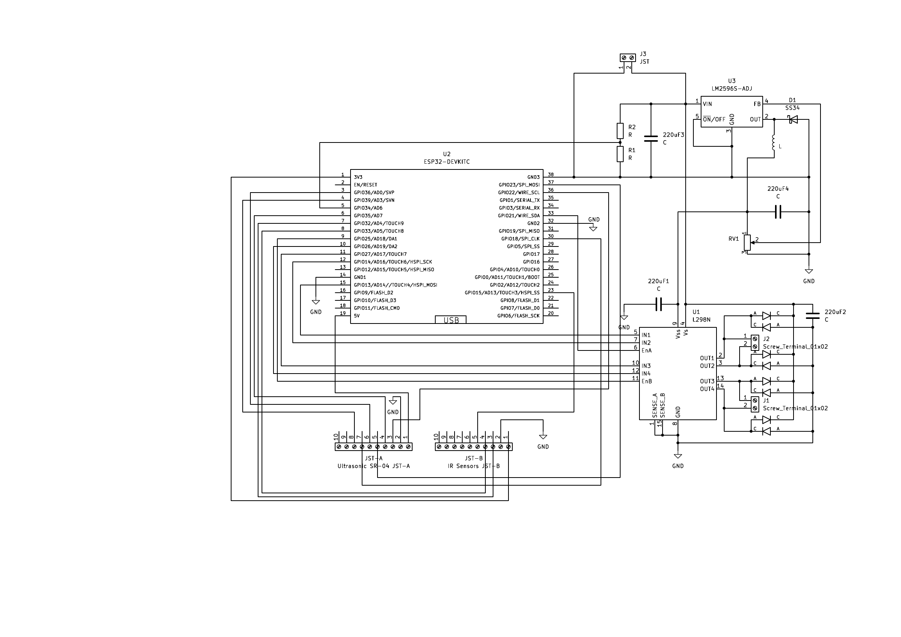
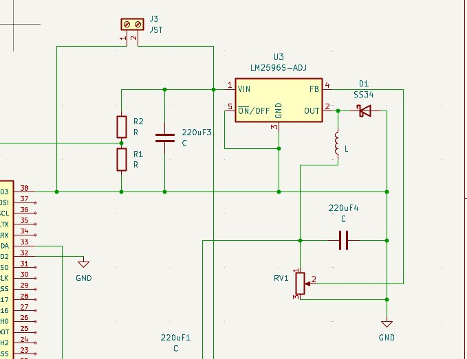
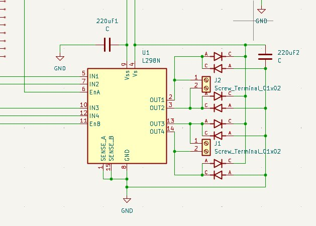

Schematic needs updating!
-> 5V input needs connecting to output of LM2596 

# 🤖 ESP32 Line Sensing Robot

A line-following robot built around the **ESP32-DEVKITC**, featuring dual motor control via L298N, 3 IR line sensors, 3 ultrasonic distance sensors, and an LM2596S-ADJ buck converter powered by a 2S LiPo (8.8V). Controlled via a custom **Android MQTT app** built in Android Studio, with full telemetry monitoring and dual control modes (accelerometer tilt + WASD buttons).

---

## 📋 Table of Contents

- [Hardware Overview](#hardware-overview)
- [Pinout Reference](#pinout-reference)
- [JST Connector Wiring](#jst-connector-wiring)
- [Power System](#power-system)
- [Sensors](#sensors)
- [Motor Control](#motor-control)
- [Android App & MQTT Control](#android-app--mqtt-control)
- [Schematic Notes](#schematic-notes)
- [Known Issues & Planned Fixes](#known-issues--planned-fixes)
- [Build Log](#build-log)
- [Schematic](#schematic)

---

## Hardware Overview

| Component | Part | Notes |
|-----------|------|-------|
| MCU | ESP32-DEVKITC | Dual-core, WiFi/BT capable |
| Motor Driver | L298N | Repurposed from L298N module — correct Schottky diodes confirmed ✅ |
| Buck Converter | LM2596S-ADJ | 8.8V → 5V, set via RV1 trimpot. Diode: SS34 Schottky ✅ |
| Power Input | 2S LiPo | 8.8V via JST J3 (2-pin) connector |
| Line Sensors | IR Sensor x3 | Digital output, 3.3V — via JST-B (10-pin) |
| Distance Sensors | HC-SR04 x3 | 2021+ version — 3.3V compatible, no voltage divider needed ✅ |
| Control App | Android (Android Studio) | MQTT-based, accelerometer + WASD control |

> ℹ️ **L298N Diodes:** Components repurposed from L298N module — correct Schottky freewheeling diodes confirmed, no substitution needed.
> ℹ️ **HC-SR04 Version:** 2021+ modules confirmed — ECHO pin outputs 3.3V logic, connects directly to ESP32 GPIO without voltage divider ✅

---

## Pinout Reference

### Motor Driver — L298N

| L298N Pin | ESP32 Header Pin | GPIO | Type | Notes |
|-----------|-----------------|------|------|-------|
| IN1 | Pin 15 | GPIO13 | Digital Output | Motor A direction |
| IN2 | Pin 12 | GPIO14 | Digital Output | Motor A direction |
| EnA | Pin 33 | GPIO21 | PWM Output | Motor A speed control |
| IN3 | Pin 11 | GPIO27 | Digital Output | Motor B direction |
| IN4 | Pin 10 | GPIO26 | Digital Output | Motor B direction |
| EnB | Pin 9 | GPIO25 | PWM Output | Motor B speed control |

### Battery Monitor

| Function | ESP32 Header Pin | GPIO | Notes |
|----------|-----------------|------|-------|
| Battery ADC | Pin 5 | GPIO34 | R1/R2 voltage divider from J3 Pin 2 (8.8V). ADC1 — WiFi safe. Input-only ✅ |

### IR Line Sensors — JST-B (10-pin)

| Sensor | GPIO | Type | Notes |
|--------|------|------|-------|
| IR Left | GPIO32 | Digital Input | ADC1 — WiFi/MQTT safe ✅ |
| IR Center | GPIO33 | Digital Input | ADC1 — WiFi/MQTT safe ✅ |
| IR Right | GPIO15 | Digital Input | Safe for digital input — IR sensors default LOW at boot ✅ |

### Ultrasonic Sensors HC-SR04 (2021+) — JST-A (10-pin)

| Sensor | TRIG GPIO | ECHO GPIO | Notes |
|--------|----------|----------|-------|
| Ultrasonic Left | GPIO22 | GPIO35 | Direct connection — no voltage divider needed ✅ |
| Ultrasonic Center | GPIO23 | GPIO36 | Direct connection — no voltage divider needed ✅ |
| Ultrasonic Right | GPIO18 | GPIO39 | Direct connection — no voltage divider needed ✅ |

> ✅ HC-SR04 2021+ version: ECHO pin outputs 3.3V logic — connects directly to ESP32 GPIO, no extra components required.

### JST Power Connector — J3 (2-pin JST)

| Pin | Signal |
|-----|--------|
| 1 | GND |
| 2 | 8.8V (LiPo input) |

---

## JST Connector Wiring

### JST-A — Ultrasonic Sensors HC-SR04 2021+ (10-pin JST)

| Pin | Signal | GPIO | Notes |
|-----|--------|------|-------|
| 1 | 5V shared | — | 5V rail (HC-SR04 requires 5V VCC) |
| 2 | GND shared | GND | |
| 3 | TRIG Left | GPIO22 | Digital output |
| 4 | ECHO Left | GPIO35 | Direct connection ✅ |
| 5 | TRIG Center | GPIO23 | Digital output |
| 6 | ECHO Center | GPIO36 | Direct connection ✅ |
| 7 | TRIG Right | GPIO18 | Digital output |
| 8 | ECHO Right | GPIO39 | Direct connection ✅ |
| 9 | — spare — | — | |
| 10 | — spare — | — | |

### JST-B — IR Line Sensors (10-pin)

| Pin | Signal | GPIO | Notes |
|-----|--------|------|-------|
| 1 | 3.3V shared | — | 3V3 rail |
| 2 | GND shared | GND | |
| 3 | IR Left | GPIO32 | Digital input, ADC1 |
| 4 | IR Center | GPIO33 | Digital input, ADC1 |
| 5 | IR Right | GPIO15 | Digital input |
| 6–10 | — spare — | — | Room to expand |

---

## Power System

```
[2S LiPo 8.8V]
      │
    J3 JST (2-pin)
      │
      ├─── R1/R2 voltage divider ─── GPIO34 (battery monitor ADC)
      │
      ├─── 220uF1 bulk capacitor (input filter)
      │
      ├─── L298N VS pin (motor supply, 8.8V direct)
      │
   LM2596S-ADJ
   D1: SS34 Schottky
   RV1 trimpot → FB pin (sets 5V output)
   Output: 220uF4 capacitor
      │
     5V rail
      │
   ESP32 DEVKITC VIN → onboard LDO → 3.3V rail
                                          │
                                          ├─── HC-SR04 VCC 5V (via JST-A Pin 1)
                                          └─── IR sensors VCC (via JST-B Pin 1)
```

- LM2596S-ADJ output set by trimpot RV1
- SS34 Schottky diode D1 confirmed ✅
- Input capacitor: 220µF bulk (100nF ceramic parallel planned)
- Output capacitor: 220µF (low-ESR recommended)

---

## Sensors

### IR Line Sensors (x3)

3 IR reflectance sensors positioned underneath the robot chassis for line detection. Digital output (3.3V modules).

- All GPIOs on ADC1 — WiFi/MQTT always active ✅
- No level shifting needed on signal lines
- Connected via JST-B

**MQTT telemetry:** `robot/telemetry/ir`
```json
{"left": 0, "center": 1, "right": 0}
```

### Ultrasonic Sensors HC-SR04 2021+ (x3)

3 ultrasonic sensors for obstacle detection (left, center, right). 2021+ version confirmed — runs on 3.3V, ECHO outputs 3.3V logic.

- Powered from 5V rail ✅
- TRIG: 3.3V ESP32 output sufficient ✅
- ECHO: direct connection to ESP32 GPIO — no voltage divider needed ✅
- ECHO GPIOs (35/36/39) are input-only ADC1 pins — perfect for ECHO signals ✅

**MQTT telemetry:** `robot/telemetry/ultrasonic`
```json
{"left": 24, "center": 8, "right": 31}
```

---

## Motor Control

Dual H-bridge via L298N. Speed via PWM on EnA/EnB, direction via IN1–IN4.

| Channel | Enable (PWM) | Dir Pin A | Dir Pin B |
|---------|-------------|-----------|-----------|
| Motor A | GPIO21 (EnA) | GPIO13 (IN1) | GPIO14 (IN2) |
| Motor B | GPIO25 (EnB) | GPIO27 (IN3) | GPIO26 (IN4) |

**Direction logic:**

| IN1 | IN2 | Motor A |
|-----|-----|---------|
| HIGH | LOW | Forward |
| LOW | HIGH | Reverse |
| LOW | LOW | Coast |
| HIGH | HIGH | Brake |

---

## Android App & MQTT Control

Custom Android app (Android Studio) communicates with the ESP32 over MQTT. The broker runs **embedded inside the APK** — no external server needed.

### Architecture

```
[Android App]
      ├── Embedded MQTT Broker (Moquette / HiveMQ, port 1883)
      └── MQTT Client
                │
           Local WiFi
                │
        [ESP32-DEVKITC]
                │
         Motors / Sensors
```

> The phone acts as both broker and client. The ESP32 connects to the broker using the phone's local IP over shared WiFi. No cloud dependency, no external setup.

### MQTT Topic Structure

| Topic | Direction | Description |
|-------|-----------|-------------|
| `robot/control/move` | App → ESP32 | `forward` / `back` / `left` / `right` / `stop` |
| `robot/control/speed` | App → ESP32 | PWM value 0–255 |
| `robot/control/mode` | App → ESP32 | `manual` or `line_follow` |
| `robot/telemetry/ir` | ESP32 → App | IR sensor states JSON |
| `robot/telemetry/ultrasonic` | ESP32 → App | Distance readings JSON (cm) |
| `robot/telemetry/battery` | ESP32 → App | Battery voltage float (V) |
| `robot/telemetry/speed` | ESP32 → App | PWM values both motors |

### Control Modes

Toggled by a single button in the app UI. Accelerometer listener is registered/unregistered on toggle to preserve battery.

**Mode 1 — Accelerometer tilt:**

| Tilt | Robot Action |
|------|-------------|
| Forward | Move forward |
| Backward | Reverse |
| Left | Steer left |
| Right | Steer right |
| Flat | Stop |

**Mode 2 — WASD buttons:**
```
      [ W ]
 [ A ][ S ][ D ]
      [STP]
```

Hold to move, release to stop. Speed adjustable via slider in both modes.

### Telemetry Dashboard

| Widget | MQTT Topic | Notes |
|--------|-----------|-------|
| IR indicators | `robot/telemetry/ir` | 3 visual indicators — line / no line |
| Ultrasonic distances | `robot/telemetry/ultrasonic` | 3 live readouts in cm |
| Battery voltage | `robot/telemetry/battery` | Live voltage + low battery warning |
| Motor speed | `robot/telemetry/speed` | PWM values both channels |
| Connection status | Internal | Broker + ESP32 link indicator |

### ESP32 Firmware — MQTT Overview

```cpp
#include <WiFi.h>
#include <PubSubClient.h>

const char* mqtt_server = "PHONE_LOCAL_IP";

void callback(char* topic, byte* payload, unsigned int length) {
  String msg = String((char*)payload).substring(0, length);
  if (String(topic) == "robot/control/move")  handleMove(msg);
  if (String(topic) == "robot/control/speed") setSpeed(msg.toInt());
  if (String(topic) == "robot/control/mode")  setMode(msg);
}

void publishTelemetry() {
  client.publish("robot/telemetry/battery",    String(batteryVoltage).c_str());
  client.publish("robot/telemetry/ir",         irStateJson().c_str());
  client.publish("robot/telemetry/ultrasonic", ultrasonicJson().c_str());
  client.publish("robot/telemetry/speed",      speedJson().c_str());
}
```

---

## Schematic Notes

### Rev 1 — 24 April 2026
- R1/R2 = battery voltage monitor ADC divider — NOT part of LM2596 feedback network
- LM2596 feedback set by RV1 trimpot — functional, fix planned for next revision
- EnA originally on GPIO12 (strapping pin conflict) — corrected to GPIO21
- L298N repurposed from module — correct Schottky diodes confirmed ✅
- LM2596 diode D1 = SS34 Schottky ✅

### Rev 2 — 25 April 2026
- JST-A (10-pin) added for 3x HC-SR04 ultrasonic sensors
- JST-B (10-pin) added for 3x IR line sensors
- HC-SR04 confirmed as 2021+ version — no voltage dividers needed on ECHO lines ✅
- Full GPIO assignments finalised and conflict-checked
- Battery ADC confirmed on GPIO34 (ADC1, input-only)

---

## Known Issues & Planned Fixes

| Priority | Issue | Status |
|----------|-------|--------|
| 🔴 Critical | LM2596 trimpot-only FB risk — wiper failure could send 8.8V to ESP32 | ⏳ Planned |
| 🔴 Critical | Fix: R_upper 1kΩ (VOUT→FB) + R_lower 1kΩ (FB→GND), RV1 in series with R_lower | ⏳ Next revision |
| 🟡 Warning | Low-ESR capacitor recommended on LM2596 220uF output | 🔍 To verify |
| 🟡 Warning | 100nF ceramic in parallel with 220uF1 input capacitor | ⏳ Planned |
| 🟡 Warning | 100nF ceramic decoupling on ESP32 VCC pins | ⏳ Planned |
| 🟢 OK | L298N diodes — repurposed from module, correct Schottky type ✅ | ✅ |
| 🟢 OK | LM2596 D1 = SS34 Schottky ✅ | ✅ |
| 🟢 OK | HC-SR04 2021+ — ECHO direct to GPIO, no voltage divider needed ✅ | ✅ |
| 🟢 OK | All IR + ECHO GPIOs on ADC1 — WiFi/MQTT safe ✅ | ✅ |
| 🟢 OK | No strapping pin conflicts in final pinout ✅ | ✅ |
| 🟢 OK | GPIO34 battery ADC — ADC1, input-only, WiFi safe ✅ | ✅ |
| 🟢 OK | J3 JST: Pin1=GND, Pin2=8.8V ✅ | ✅ |

### LM2596 Planned Fix Detail

```
VOUT ── R_upper (1kΩ) ── FB ── RV1 (1kΩ trim) ── R_lower (1kΩ) ── GND
```

`Vout = 1.23 × (1 + R_lower_total / R_upper)`

With fixed resistors as base, a trimpot wiper failure cannot cause a catastrophic voltage spike on the 5V rail.

---

## Build Log

| Date | Entry |
|------|-------|
| 24 Apr 2026 | Rev 1 schematic complete. ESP32 + LM2596 + L298N architecture established. |
| 24 Apr 2026 | GPIO12 strapping conflict on EnA found and corrected → GPIO21. |
| 24 Apr 2026 | R1/R2 confirmed as battery ADC divider, not LM2596 feedback. |
| 24 Apr 2026 | L298N repurposed from module — correct Schottky diodes confirmed. |
| 24 Apr 2026 | Android MQTT app architecture defined — embedded broker, dual control modes, telemetry dashboard. |
| 25 Apr 2026 | JST-A (ultrasonic) and J5 (IR sensors) connectors added to schematic and PCB. |
| 25 Apr 2026 | Full GPIO conflict check performed — all pins verified clean. |
| 25 Apr 2026 | HC-SR04 confirmed as 2021+ version — voltage dividers removed from design. |
| 25 Apr 2026 | Final GPIO assignments locked in for all motors, sensors, and battery ADC. |
| 25 Apr 2026 | LM2596 D1 = SS34 Schottky confirmed from schematic. |
| 25 Apr 2026 | Schematic Rev 2 exported — JST-A and JST-B fully connected, all sensor GPIO traces complete. |

---

## 📌 Complete GPIO Map

| GPIO | Header Pin | Function | Type | Notes |
|------|-----------|----------|------|-------|
| GPIO13 | Pin 15 | Motor A IN1 | Output | L298N |
| GPIO14 | Pin 12 | Motor A IN2 | Output | L298N |
| GPIO15 | — | IR Right | Input | JST-B |
| GPIO18 | — | TRIG Right | Output | JST-A ultrasonic |
| GPIO21 | Pin 33 | EnA Motor A | PWM Output | L298N |
| GPIO22 | — | TRIG Left | Output | JST-A ultrasonic |
| GPIO23 | — | TRIG Center | Output | JST-A ultrasonic |
| GPIO25 | Pin 9 | EnB Motor B | PWM Output | L298N |
| GPIO26 | Pin 10 | Motor B IN4 | Output | L298N |
| GPIO27 | Pin 11 | Motor B IN3 | Output | L298N |
| GPIO32 | — | IR Left | Input | ADC1, JST-B |
| GPIO33 | — | IR Center | Input | ADC1, JST-B |
| GPIO34 | Pin 5 | Battery ADC | Input | ADC1, input-only, R1/R2 divider |
| GPIO35 | — | ECHO Left | Input | ADC1, input-only, JST-A |
| GPIO36 | — | ECHO Center | Input | ADC1, input-only, JST-A |
| GPIO39 | — | ECHO Right | Input | ADC1, input-only, JST-A |

---

## Schematic

### Full Schematic — Rev 2



*ESP32-DEVKITC + LM2596S-ADJ power section + L298N motor driver + JST-A ultrasonic connector + J5 IR sensor connector*

---

### LM2596S-ADJ — Buck Converter & Battery Monitor



*8.8V input via J3 JST (2-pin). R1/R2 voltage divider for battery ADC on GPIO34. LM2596S-ADJ with SS34 Schottky diode D1, inductor L, 220µF output capacitor, and RV1 trimpot setting 5V output via FB pin.*

---

### L298N — Motor Driver



*L298N dual H-bridge with Schottky freewheeling diodes on all outputs. Motor A: IN1 (GPIO13), IN2 (GPIO14), EnA (GPIO21). Motor B: IN3 (GPIO27), IN4 (GPIO26), EnB (GPIO25). Outputs to J1 and J2 screw terminals.*
